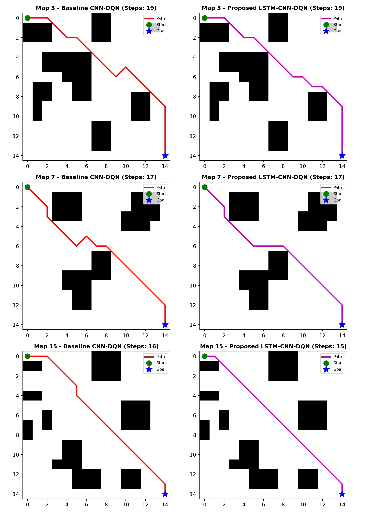

# Enhancing Deep Reinforcement Learning with Spatiotemporal Modeling for Mobile Robot Path Planning

[](https://www.python.org/downloads/)
[](https://pytorch.org/)
[](https://opensource.org/licenses/MIT)
[]()

Official PyTorch implementation, benchmark environments, and pretrained checkpoints for the manuscript:

> **"Enhancing Deep Reinforcement Learning with Spatiotemporal Modeling for Mobile Robot Path Planning"**  
> *Engineering Applications of Artificial Intelligence* (EAAI), Manuscript No: **EAAI-26-5904**.  
> Authors: Abderrahim Waga, Fatima Zahrae Saber, Jawad Abdouni, Toufik Mzili, Ahmed Regragui.

---

## Table of Contents
- [Overview](#overview)
- [Key Features & Architecture](#key-features--architecture)
- [Repository Structure](#repository-structure)
- [Installation & Quick Start](#installation--quick-start)
- [Reproducing Paper Results](#reproducing-paper-results)
- [Pretrained Models & Empirical Benchmark](#pretrained-models--empirical-benchmark)
- [Statistical Significance Analysis](#statistical-significance-analysis)
- [Training From Scratch](#training-from-scratch)
- [Data Availability Statement](#data-availability-statement)
- [Citation](#citation)
- [License](#license)

---

## Overview

Autonomous mobile robot path planning in partially observable, obstacle-dense environments often suffers from oscillation loops, visual deadlocks, and severe generalization drop when deployed in unseen layouts.

This work addresses these fundamental limitations by introducing a **spatiotemporal Deep Reinforcement Learning architecture** combining:
1. **Egocentric Local Perception ($11 \times 11$)**: Bounded sensory footprint reducing dimensional state complexity and suppressing distant clutter.
2. **Convolutional Feature Extraction**: 2-layer CNN spatial representation learning.
3. **Temporal Recurrence (LSTM, $T=4$)**: Memorization of past trajectories to disambiguate occluded obstacles and escape local minima.
4. **Dueling Q-Network Heads**: Decoupled state value $V(s)$ and action advantage $A(s, a)$ estimation for fine-grained trajectory control.

<p align="center">
  
  <br>
  <em>Figure 1: Trajectory comparisons across unseen environments showing Baseline CNN-DQN (left) suffering from loops and collisions vs. Proposed LSTM-CNN-DQN (right) reaching the target efficiently.</em>
</p>

---

## Key Features & Architecture

| Component | Baseline CNN-DQN | Ablation 1 (Local CNN) | Ablation 2 (Dueling CNN) | Proposed (LSTM-CNN-DQN) |
| :--- | :--- | :--- | :--- | :--- |
| **Observation Space** | Global ($15 \times 15$) | Local ($11 \times 11$) | Local ($11 \times 11$) | **Local ($11 \times 11$)** |
| **CNN Backbone** | 2-layer Conv2D | 2-layer Conv2D | 2-layer Conv2D | **2-layer Conv2D** |
| **Temporal Recurrence** | None (Single Frame) | None (Single Frame) | None (Single Frame) | **LSTM ($T=4$, 128 hidden)** |
| **Value / Advantage** | Standard Single Head | Standard Single Head | Dueling Heads | **Dueling Heads** |
| **Action Space** | 8-connected grid | 8-connected grid | 8-connected grid | **8-connected grid** |

---

## Repository Structure

```
.
├── checkpoints/                        # Pretrained PyTorch model weights (.pth)
│   ├── baseline_cnn_dqn.pth            # Global 15x15 CNN-DQN (7.06 MB)
│   ├── local_cnn_dqn.pth               # Local 11x11 CNN-DQN (3.81 MB)
│   ├── dueling_cnn_dqn.pth             # Local 11x11 Dueling CNN-DQN (7.60 MB)
│   └── lstm_cnn_dqn.pth                # Proposed LSTM-CNN-DQN (7.97 MB)
│
├── data/                               # Benchmark datasets (.npz archives)
│   ├── train_grids_500.npz             # 500 procedural training environments (Seed 42)
│   └── test_grids_500.npz              # 500 unseen evaluation environments (Seed 100)
│
├── results/                            # Pre-generated publication figures and logs
│   ├── training_curves_confidence_bands.png
│   ├── trajectory_comparisons_3maps.png
│   └── evaluation_summary_500maps.csv
│
├── src/                                # Core implementation modules
│   ├── env.py                          # 2D GridWorld with local/global observation modes
│   ├── models.py                       # PyTorch neural network architectures
│   └── replay_buffer.py                # Frame and sequence experience replay buffers
│
├── evaluate.py                         # Single-command evaluation & statistical test script
├── train.py                            # End-to-end training pipeline for all 4 variants
├── requirements.txt                    # Python package dependencies
├── .gitignore                          # Git tracking rules
└── README.md                           # Documentation and instructions
```

---

## Installation & Quick Start

### 1. Clone the repository
```bash
git clone https://github.com/<your-username>/lstm-cnn-dqn-path-planning.git
cd lstm-cnn-dqn-path-planning
```

### 2. Create virtual environment & install requirements
```bash
python3 -m venv venv
source venv/bin/activate
pip install -r requirements.txt
```

---

## Reproducing Paper Results

All tables and metrics reported in the paper can be reproduced with a single command on CPU or GPU.

### Reproduce Core Evaluation (100 Unseen Maps, Table 3)
```bash
python evaluate.py --num_maps 100 --device cpu
```

### Reproduce Extended Benchmark & Statistical Tests (500 Unseen Maps, Table 4)
```bash
python evaluate.py --num_maps 500 --device cpu
```

This command will:
1. Load all 4 pretrained models from `checkpoints/`.
2. Evaluate each model across 500 identical unseen test environments from `data/test_grids_500.npz`.
3. Compute parametric (Mean $\pm$ Std) and outlier-robust (Median, IQR) path lengths.
4. Execute paired **McNemar's test** ($\chi^2$ and $p$-value) and **Wilcoxon signed-rank test** ($W$ and $p$-value).
5. Output results directly to console and save summary to `results/evaluation_summary_500maps.csv`.

---

## Pretrained Models & Empirical Benchmark

### 1. Extended Benchmark Results (500 Unseen Environments)

| Model Architecture | Success Rate (%) | Path Length (Mean $\pm$ Std) | Median (IQR) | Mean Reward | Latency (CPU) | Parameters |
| :--- | :---: | :---: | :---: | :---: | :---: | :---: |
| **Baseline Global CNN-DQN** | 64.00% | 85.08 $\pm$ 86.85 | 23.0 (183.0) | -4.41 $\pm$ 21.65 | **0.651 ms** | 1,847,560 |
| **Ablation 1: Local CNN-DQN** | 71.80% | 71.39 $\pm$ 80.52 | 21.0 (179.0) | -0.73 $\pm$ 19.98 | 0.627 ms | 993,544 |
| **Ablation 2: Dueling CNN-DQN** | 73.00% | 69.23 $\pm$ 79.94 | 21.0 (179.0) | -0.19 $\pm$ 19.78 | 0.702 ms | 1,988,361 |
| **Proposed: LSTM-CNN-DQN** | **90.60%** | **37.07 $\pm$ 54.02** | **20.0 (2.0)** | **+8.48 $\pm$ 12.92** | 4.660 ms | 2,084,745 |

### Key Takeaways:
- **+26.60% absolute gain** in navigation success rate over the baseline on 500 unseen test layouts.
- **Outlier Robustness**: Median path length is **20.0** with an Interquartile Range (IQR) of only **2.0 steps**, demonstrating near-zero timeout wandering compared to the baseline IQR of **183.0 steps**.
- **Real-Time Feasibility**: Inference latency is **4.66 ms/step** on CPU (>214 Hz), fully compatible with low-power onboard mobile robotics hardware (Raspberry Pi 4 / NVIDIA Jetson).

---

## Statistical Significance Analysis

Pairwise statistical tests conducted on the 500 unseen environments confirm the superiority of the proposed LSTM-CNN-DQN:

- **McNemar's Test (Navigation Success / Failure Contingency)**:
  - Both Succeeded: $314$ | Baseline Only: $6$ | LSTM Only: $139$ | Both Failed: $41$
  - **$\chi^2 = 101.8947$**, **$p = 5.86 \times 10^{-24}$** ($p \ll 0.001$)
- **Wilcoxon Signed-Rank Test (Trajectory Step Efficiency)**:
  - **$W = 6039.0$**, **$p = 1.01 \times 10^{-38}$** ($p \ll 0.001$)

Both tests demonstrate that the improvements are statistically significant and not artifacts of stochastic variation.

---

## Training From Scratch

To train any model from scratch using the benchmark dataset:

```bash
# Train Proposed LSTM-CNN-DQN
python train.py --algo lstm --episodes 500 --lr 1e-4 --batch_size 32

# Train Ablation Variants
python train.py --algo baseline --episodes 500
python train.py --algo cnn_local --episodes 500
python train.py --algo dueling_local --episodes 500
```

Trained checkpoints and training metric logs (`metrics.csv`) will be saved in `checkpoints/`.

---

## Data Availability Statement

In compliance with the reproducibility policies of *Elsevier* and *Engineering Applications of Artificial Intelligence*, all data, simulation environments, evaluation scripts, and pretrained network weights associated with this study are publicly deposited:

- **Source Code & Models**: [https://github.com/<your-username>/lstm-cnn-dqn-path-planning](https://github.com/<your-username>/lstm-cnn-dqn-path-planning)
- **Benchmark Environments**:
  - `data/train_grids_500.npz`: 500 binary occupancy grids generated with seed `42` (obstacle ratio: 0.18).
  - `data/test_grids_500.npz`: 500 completely unseen binary occupancy grids generated with seed `100`.
- **Pretrained Checkpoints**: Full PyTorch weights for Baseline, Local CNN, Dueling CNN, and Proposed LSTM-CNN-DQN in `checkpoints/`.

---

## Citation

If you find this code or dataset useful in your research, please cite our paper:

```bibtex
@article{waga2026enhancing,
  title={Enhancing Deep Reinforcement Learning with Spatiotemporal Modeling for Mobile Robot Path Planning},
  author={Waga, Abderrahim and Saber, Fatima Zahrae and Abdouni, Jawad and Mzili, Toufik and Regragui, Ahmed},
  journal={Engineering Applications of Artificial Intelligence},
  volume={--},
  pages={--},
  year={2026},
  publisher={Elsevier}
}
```

---

## License

This project is licensed under the MIT License - see the [LICENSE](LICENSE) file for details.
